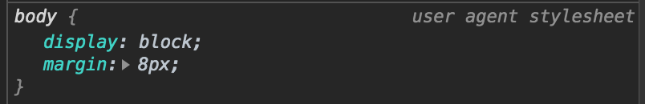

# Snips Client

## Setup

Please create your own snips client repository and follow along with this lesson.

## CSS

Hi Scott! Here are the steps I followed to make my CSS.

I have a color palette based on the Ocean theme from [Highlightjs](https://highlightjs.org/static/demo/)

- <span style="background-color: #ECECED">#ECECED</span>
- <span style="background-color: #C0C5CE">#C0C5CE</span>
- <span style="background-color: #CF8770">#CF8770</span>
- <span style="background-color: #B48EAD">#B48EAD</span>
- <span style="background-color: #2B3039; color: #ECECED">#2B3039</span>

### `header`

1. set the `background-color: #2B3039`
2. give everything some space: `padding: 10px 2rem`
3. This is a good time to introduce box model: what is padding, margin, border
4. What is `rem`? Based on base font-size: set `body` `font-size: 16px`
   1. this might be a good time to talk about units in CSS: `px`, `%`, `em`, `rem`

### `body`

Ok ew, our `body` is just like hanging a few pixels off from the edge.
This is because Chrome has **default styles** applied to every element.
Check in the dev tools inspector and you will see them.



The _user agent stylesheet_ is the default CSS that Chrome adds to every page.

We want to remove or _reset_ these styles.

Well, `display: block` is fine, but the `margin: 8px` is what's make things look weird.

So add

```css
body {
  margin: 0;
}
```

### Nav

Let's put all those `a` tags into a list

```html
<ul>
  <li><a href="/">Home</a></li>
  <li><a href="#competitors">Competitors</a></li>
  <li><a href="pages/about.html">About</a></li>
  <li><a href="pages/snippets.html">Snippets</a></li>
  <li><a href="pages/account.html"> Account</a></li>
</ul>
```

Notice how these tags make a bulletted lest in the rendered page.
We don't want that for our nav.
We can do a bit of styling to fix that:

#### `ul`

The list has a lot of weird spacing. This is also due to default styles.
Let's ammend our reset style:

```css
body,
ul {
  margin: 0;
  padding: 0;
}
```

Now we are resetting the margin/padding on both our `body` and `ul` elements.

#### `header li`

1. add `display: inline-block`

This makes all the list items render _inline_, which means that they will be next each other.

#### `header a`

I want to make this text prettier.

1. `padding: 5px` - space around
1. `color: white`
1. `text-decoration: none` - removes the underline

Let's add a hover effect

```css
header a:hover {
  color: #b48ead;
}
```

The `:hover` is called **psuedo-selector**.
These styles will only be applied when the `header a` tag is in a certain state: in this case, when it is being _hovered_.

Looks nice! But the effect is kinda jarring. We can add a **transition** to fix that.

1. To `header a` add `transition: color 250ms;` This make the color slowly transition over a quarter of a second.

### Hero

A **hero** section is a common trend in modern websites.
This usually consists of a large call-to-action right at the top of the homepage, often with a background image or video (show some examples).

The first `section` of our `main` is like our hero.
It has the site name and some description.
Let's turn this section into our hero!

First, let's change the _lorem ipsum_ in our `h2` to some actual text:

1. replace with `The slickest, fastest way to save and share your code snippets.`

(I also added ✂️ emojis on either side of the word _Snips_ like so: `✂️ Snips ✂️`. I like how it looks. Completely unncessary though)

So let's get to styling this section.

We need a way to select just this section.

1. Give the `section` an `id` of `hero`: `<section id="hero">`
2. We can style this element in our CSS with the selector `#hero`
3. Discuss selector specificity: element < class < id < inline

#### `#hero`

I want to add a [background image](https://thumbor.forbes.com/thumbor/960x0/https://blogs-images.forbes.com/rajatbhageria/files/2017/09/code-copy-1200x1200.jpg) to our hero

1. `background: url(https://thumbor.forbes.com/thumbor/960x0/https://blogs-images.forbes.com/rajatbhageria/files/2017/09/code-copy-1200x1200.jpg)`

This doesn't look too pretty, let's give it some space to shine

2. `height: 50vh` - another unit, **view height**, calculated based on the height of the browser
3. `min-height: 300px` - so it doesn't get squished on small screens
4. `padding: 50px` - just make
5. `background-size: cover` - There are a few different ways to have background images
   1. `cover`: Makes sure that the entire element is covered by the image. Scales the image as large as possible without stretching the image. If the proportions of the image differ from the element, it is cropped either vertically or horizontally so that no empty space remains.
   2. `contain`: Scales the image as large as possible without cropping or stretching the image.
   3. Or any combination of units
6. `color: white` - so we can see the text
7. `text-align: center`

It's pretty damn hard to read our text

8. Change `background` to
   ```
   background: linear-gradient(
       hsla(311, 20%, 13%, 0.75),
       hsla(311, 20%, 13%, 0.75)
     ), url(https://thumbor.forbes.com/thumbor/960x0/https%3A%2F%2Fblogs-images.forbes.com%2Frajatbhageria%2Ffiles%2F2017%2F09%2Fcode-copy-1200x1200.jpg);
   ```
   This adds a gradient over our background image so that the text stands out more.
   **NOTE:** you may need to explain `linear-gradient` first and do an example with an actual gradient because this one is just a gradient between the same two colors (aka no gradient).
   1. Here is a good time to talk about color: HSL vs RGB vs HEX etc.

#### `#hero h1`

I want to add a few styles to the `h1` to make it look better:

1. `margin-bottom: 1rem`
2. `font-size: 5rem`
3. `text-shadow: 2px 2px 2px rgba(0, 0, 0, 0.5)` - [text-shadow](https://developer.mozilla.org/en-US/docs/Web/CSS/text-shadow) adds shadow to text (no shit). The four properties are **offset-x**, **offset-y**, **blur-radius**, **color**. Notice I am using the `rgba` color to get some black with a bit of transparency.

#### `#hero h2`

We can give the `h2` a similar treatment:

1. `max-width: 600px`
2. `margin: auto` - this along with the `max-width` will give our text some wrapping and ensure that it is still always centered.
3. `font-size: 2rem`
4. `text-shadow: 2px 2px 2px rgba(0, 0, 0, 0.5)`

### CSS Modules

Our stylesheet is getting pretty busy.
Like JavaScript, we can break up our code into **modules**.

1. Create 3 new files: `header.css`, `hero.css`, `reset.css`
2. Cut out the appropriate code and put into each file

   `header.css`

   <!-- prettier-ignore -->
   ```css
   header {...}

   header li {...}

   header a {...}

   header a:hover {...}
   ```

   `hero.css`

   <!-- prettier-ignore -->
   ```css
   #hero {...}

   #hero h1 {...}

   #hero h2 {...}
   ```

   `reset.css`

   <!-- prettier-ignore -->
   ```css
   body,
   ul {
     margin: 0;
     padding: 0;
   }

   ```

3. Import files into our `style.css` (make sure to add this to the top of the file):

   ```css
   @import "./reset.css";
   @import "./header.css";
   @import "./hero.css";
   ```

   These styles will be _imported_ into our `style.css` file and essentially be loaded in place (so order matters).

### Fonts

The default fonts for Chrome aren't bad, but we can make our page look more unique and fun with some fonts.
[Google Fonts](https://fonts.google.com/) is a great free resource for fonts.

1. Go to [Google Fonts](https://fonts.google.com/) and choose a font. I chose [Montserrat](https://fonts.google.com/specimen/Montserrat)
2. Hit the plus sign to add to your fonts
3. Expand the window on the bottom right of the screen and copy the code blocks (make sure you have the `@import` method selected)
4. Drop in into your `style.css`: `@import url('https://fonts.googleapis.com/css?family=Montserrat&display=swap');`
5. Use this font in your `body`: `font-family: "Montserrat", sans-serif;`

### The rest of the page

**Note to Scott:** the rest of the page I styled with flexbox and grid.
I think we may want to save this CSS for the _Advanced CSS_ day.

Feel free to let them work on styling their portfolios.
